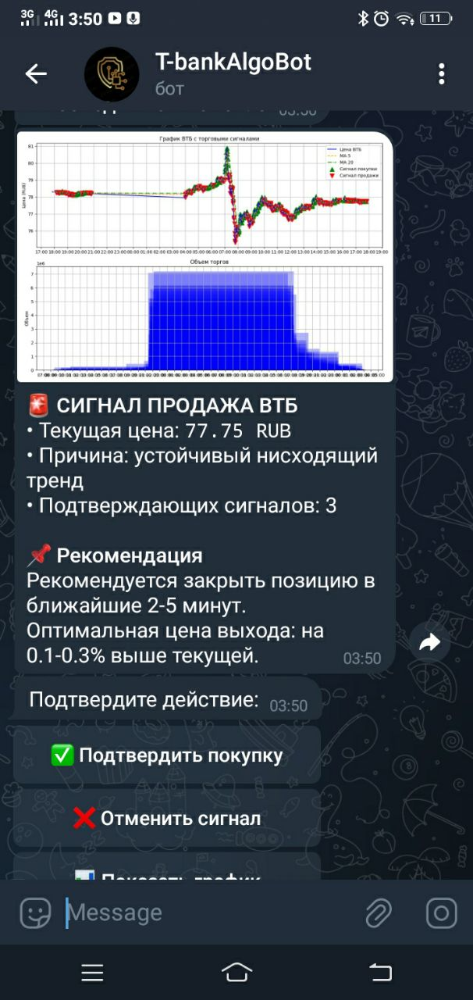
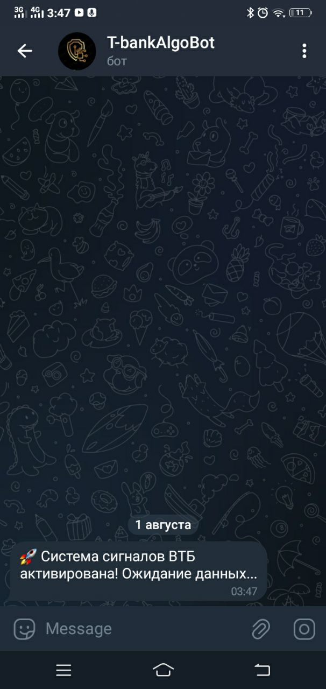
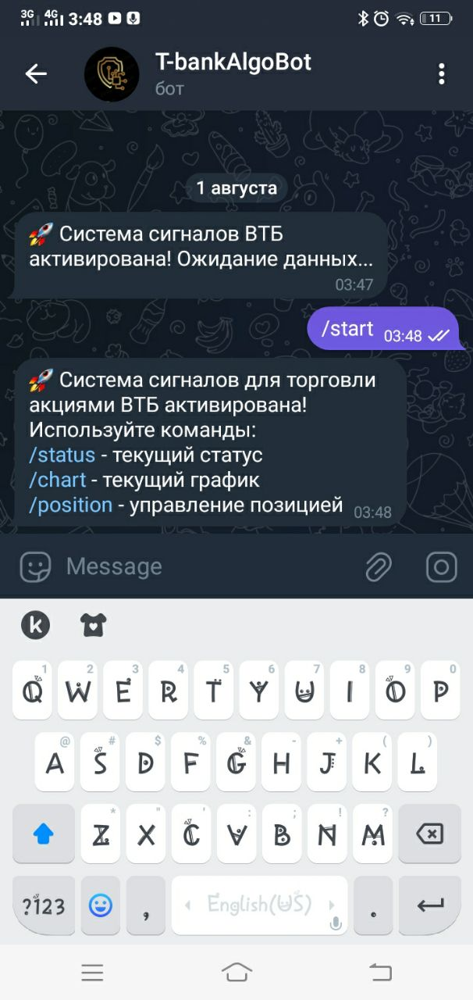
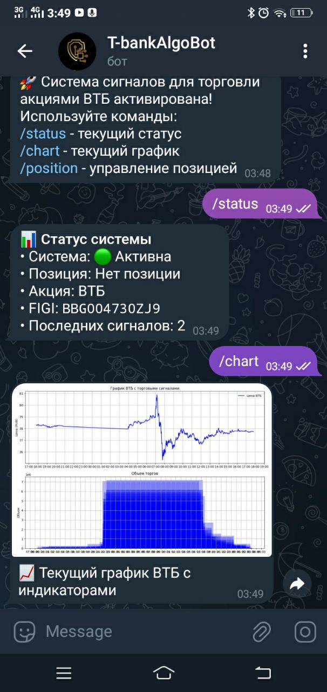

# Торговая система сигналов для акций ВТБ

[](https://www.python.org/)
[](https://core.telegram.org/bots)

# Торговая система для скальпинга акций ВТБ (VTB) на Московской бирже с использованием Tinkoff Invest API и Telegram-бота.


## Основные функции
- 📊 Автоматический анализ ценовых данных в реальном времени
- 🚀 Сигналы на покупку/продажу на основе стратегии скользящих средних (MA)
- 📈 Генерация графиков с индикаторами
- 🔔 Уведомления в Telegram с подтверждением действий
- ⚠️ Система управления рисками (стоп-лосс, тейк-профит)
- ⏱️ Мониторинг позиций в реальном времени

## Требования
- Python 3.8+
- Tinkoff Invest API токен
- Telegram Bot API токен
- Учетная запись Tinkoff Invest

# Установите зависимости:

bash
pip install -r requirements.txt

# Настройте конфигурацию:

python
TOKEN = "ВАШ_TINKOFF_TOKEN"  # Получить: Т-Инвестиции в настройках учетной записи.

TELEGRAM_TOKEN = "ВАШ_TELEGRAM_BOT_TOKEN"  # Создать через @BotFather

TELEGRAM_CHAT_ID = "ВАШ_CHAT_ID"  # Узнать через @userinfobot


# Запуск
bash
python real_scalping.py

# Команды Telegram-бота

## Команда	Описание

/start	Запуск системы

/status	Текущий статус и позиция

/chart	Получить текущий график

/position	Управление позицией


# Интерфейс управления

 
 
 

# Технические параметры

python

FIGI = "BBG004730ZJ9"          # FIGI акции ВТБ

TRADE_INTERVAL = 1_MIN         # Таймфрейм свечей

SHORT_MA_PERIOD = 5            # Период короткой MA

LONG_MA_PERIOD = 20            # Период длинной MA

HISTORY_DAYS = 1               # Глубина истории

SIGNAL_CONFIRMATION = 3        # Количество подтверждений сигнала


## Система управления рисками

Автоматические предупреждения при:

Убытке >3%

Прибыли >5%

Критическом убытке >5%

# Рекомендации по ордерам:

Стоп-лосс: -3% от цены входа

Тейк-профит: +3% от цены входа

# Важные предупреждения

🚨 Никогда не публикуйте реальные API-токены в открытом доступе

⚠️ Тестируйте систему на демо-счете перед использованием с реальными средствами

📉 Торговля на бирже связана с риском потери капитала

# Лицензия

Проект распространяется под лицензией MIT. Подробнее см. в файле LICENSE.

# Установка
1. Клонируйте репозиторий:
```bash
git clone https://github.com/Marat2112/vtb_trading_signals_bot.git
cd vtb_trading_signals_bot
